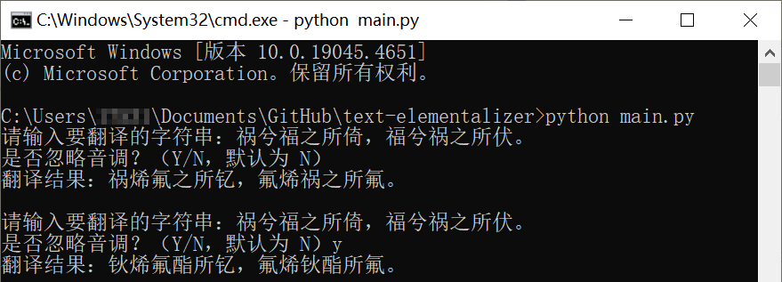

# text-elementalizer

a text elementalizer replacing the appropriate text with the name of the chemical element based on pinyin.

基于汉语拼音，将输入文本中的中文字符替换为对应的化学元素名称。



# How to use

1. Clone this repo

   ```
   git clone https://github.com/Snoopy1866/text-elementalizer.git
   ```

2. Install dependencies

   ```
   pip install pypinyin
   ```

3. Run the program

   ```
   python main.py
   ```

# Acknowledgements

- [pypinyin](https://github.com/mozillazg/python-pinyin)
